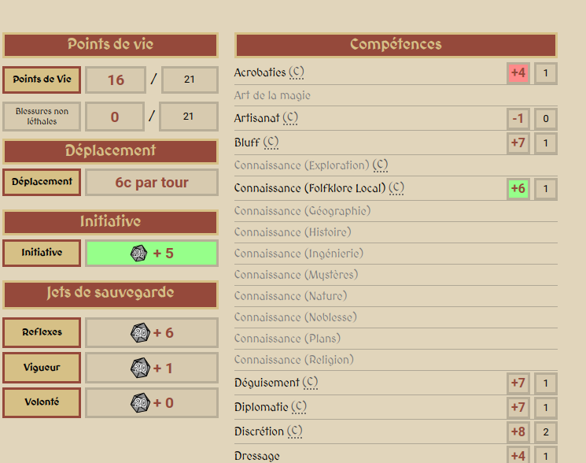
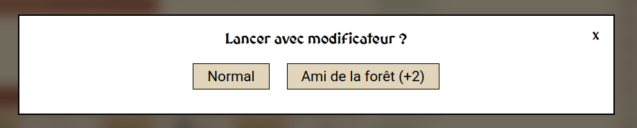
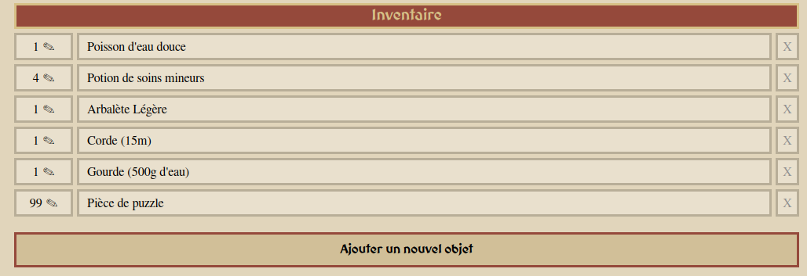
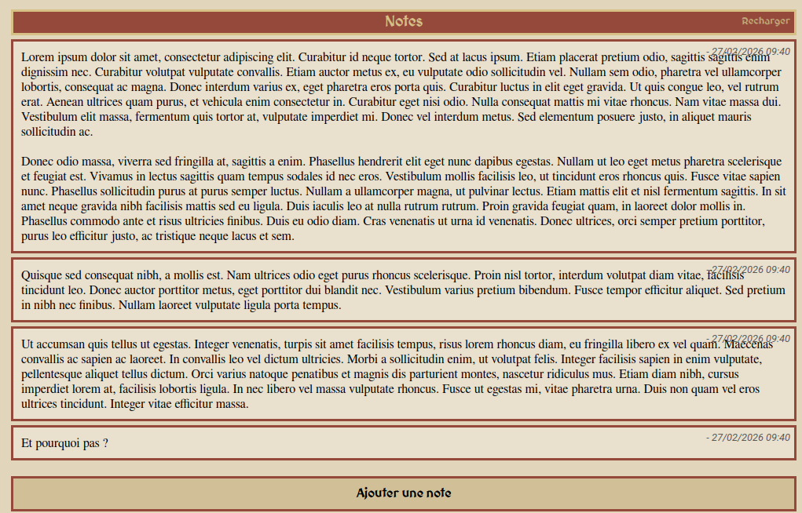

# DND Beyond, but for Pathfinder 1e

- Available at https://pf.blue112.eu/
- Fully free and open source

# Current status

- No login required
- Create a character sheet, and update it
- Share your player sheet with a simple link
- See edits made by others in real time
- Launch dice directly from your sheet, including your modifiers, and have an history of dice launch
- Add temporary modifiers on AC, saving throws, skills, attack and damager weapon modifiers
- Manage weapons in a flexible way
- Manage inventory and money
- Add custom notes to note down anything you want to remember

## Features handled

- Automatic sheet calculation (AC, skill mod modifiers, carac modifiers, saving throws, initiative, ...)
- Full sheet edit history
- Basic character details (name, player name, size, weight...)
- 2 classes (Invoker Unchained, Rogue Unchained)
- Size modifier
- HP management (lethal only)
- Level up with HP dice roll
- Predilection class (+1 HP)
- Class skills, with possibility to add custom ones
- Ranking up skills
- D20, D6 and D3 visual launch (with 3D dices!)

- Critical success and failure
- Sharable link (anyone can edit for now though)
- Temporary modifiers full management, with highlight of modified fields
  
  

- Exceptional modifiers (+2 bluff when talking to a goblin ?)
  
- Inventory management with quantity
  
- Money management
- Notes management
  

## Campaign mode

- Group multiple sheets and have an overview as a DM

# Goals

- Create as many players as you wish ✅
- Share your player sheet with a simple link ✅
- See edits in real time ✅
- Do changes on your sheet directly, everything is re-calculated automatically ✅
- Launch dices directly from your sheet ✅
- Manage fights with a whole party as a DM ⏳
- Full Spell management

### Powered by Haxe
